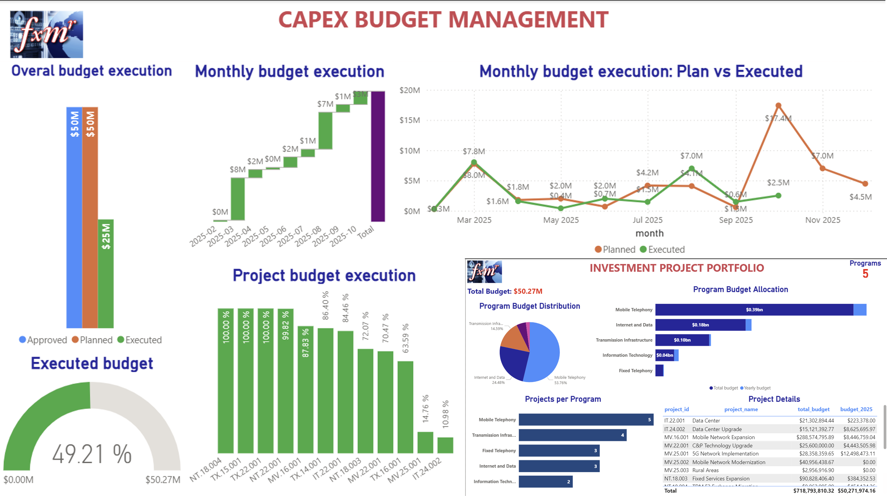
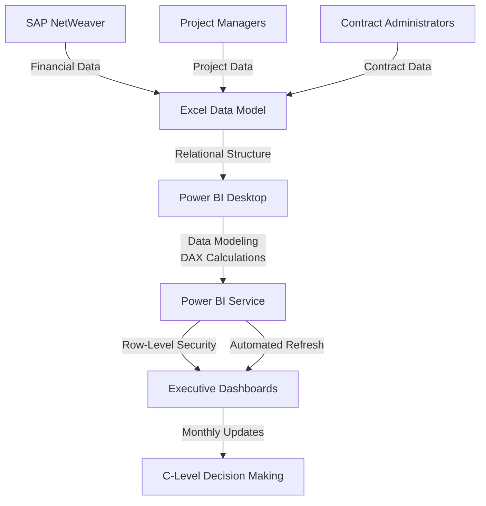
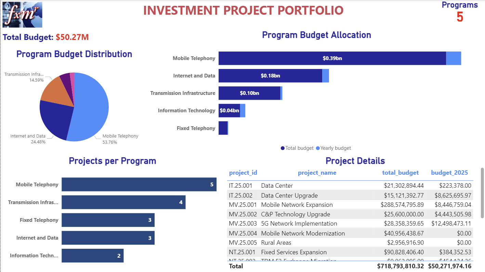
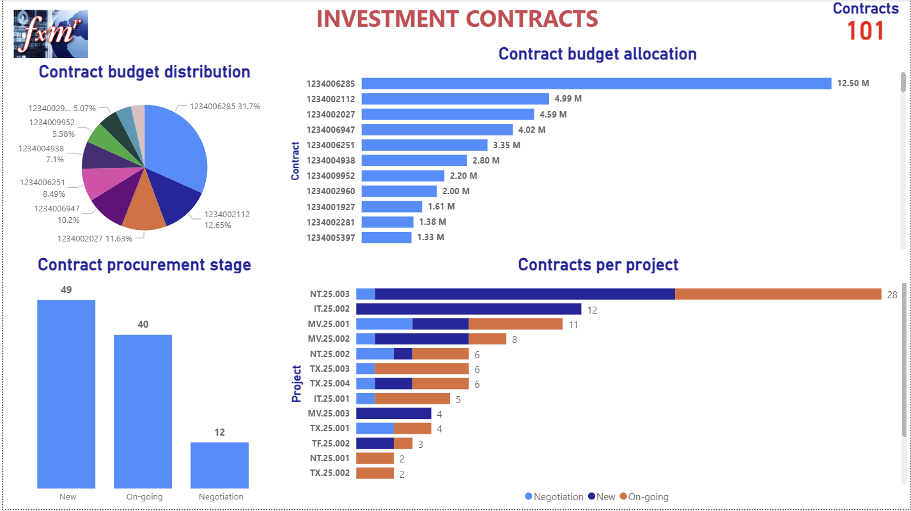
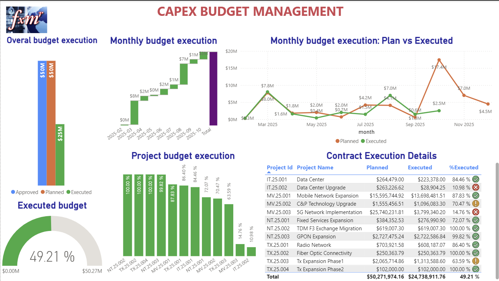
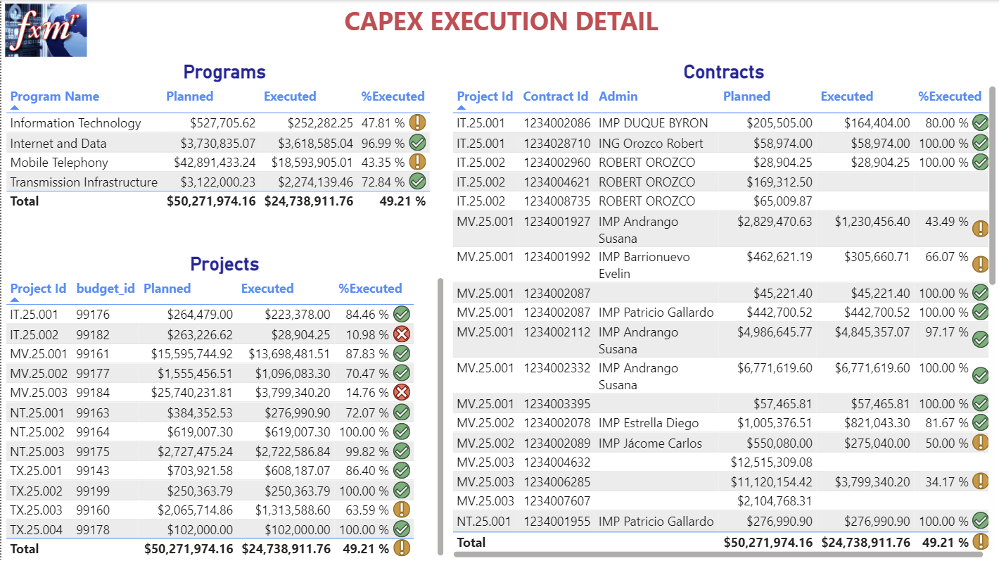
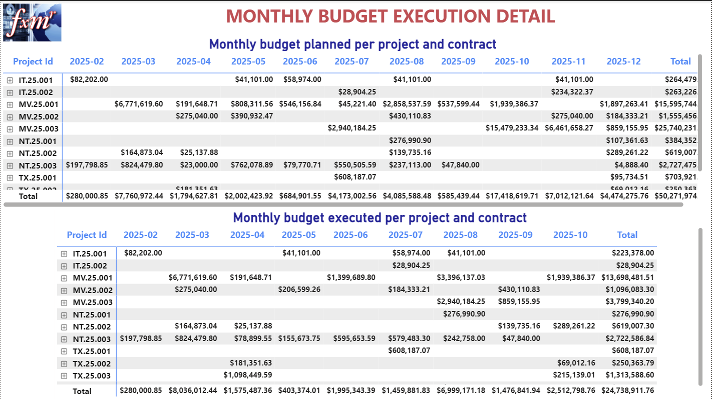
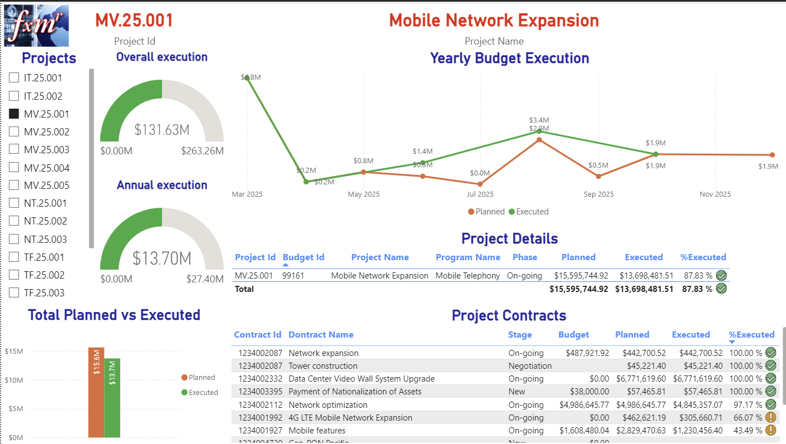

# 📊 Enterprise Budget Management Dashboard System

> **Transforming financial visibility for telecommunications infrastructure investment management**

[](https://powerbi.microsoft.com/)
[](https://www.microsoft.com/en-us/microsoft-365/excel)
[](https://www.sap.com/)
[](https://docs.microsoft.com/en-us/dax/)

## 🎯 Project Overview

A comprehensive business intelligence solution that consolidated fragmented financial data into unified Power BI dashboards, providing C-level executives real-time visibility over a **multi-million dollar telecommunications infrastructure portfolio** across **strategic-structured programs, projects and procurement contracts.**

### 🏆 Key Achievements

- ✅ **Unified Data Source:** Consolidated multiple conflicting financial data sources into single source of truth
- ✅ **Real-Time Visibility:** Enabled C-level decision-making with up-to-date budget execution tracking
- ✅ **Process Improvement:** Identified systemic data inconsistencies, triggering enterprise-wide operational enhancements
- ✅ **Executive Adoption:** Monthly review cycle established with full stakeholder engagement
- ✅ **Cost-Effective:** Leveraged existing Microsoft licenses, minimizing additional infrastructure investment

---



---

## 📋 Table of Contents

- [Business Problem](#-business-problem)
- [Solution Architecture](#-solution-architecture)
- [Dashboard Capabilities](#-dashboard-capabilities)
- [Technical Stack](#-technical-stack)
- [Business Impact](#-business-impact)
- [Implementation Approach](#-implementation-approach)
- [Dashboard Previews](#-dashboard-previews)
- [Lessons Learned](#-lessons-learned)
- [Contact](#-contact)

---

## 🚨 Business Problem

### The Challenge

The Technical National Management area of a major telecommunications corporation managed substantial infrastructure investments but operated with **critical visibility gaps**:

| Challenge | Impact |
|-----------|--------|
| **Data Fragmentation** | Contract administrators maintained separate, unconsolidated files |
| **Information Conflicts** | Financial reports from different departments showed contradictory values for the same contracts |
| **Decision Delays** | C-level management lacked reliable data for timely strategic decisions |
| **Governance Risk** | No standardized reporting framework for a multi-million dollar portfolio |
| **Accountability Issues** | Unclear ownership and tracking of budget execution |

### Portfolio Complexity

```
📦 Portfolio Scope
├── 💰 Total Budget: $718.8M
├── 📅 Annual Budget: $50.3M (2025)
├── 📊 Programs: 5 strategic initiatives
├── 🎯 Projects: 17 active projects
│   ├── New: 3
│   ├── Ongoing: 6
│   └── Closed: 8
└── 📄 Contracts: 101 contracts
    ├── Negotiation: 12
    ├── New: 49
    └── Ongoing: 40
```

---

<a name="solution-architecture"></a>
## 🏗️ Solution Architecture

### System Design



### Technology Components

**Data Layer**
- **Primary Source:** SAP NetWeaver (Financial & HR systems)
- **Validation Sources:** Project Manager inputs, Contract Administrator records
- **Integration Middleware:** Microsoft Excel (structured relational database)

**Analytics Layer**
- **Platform:** Microsoft Power BI Pro
- **Data Modeling:** Power Query (M language), SQL
- **Calculations:** DAX (Data Analysis Expressions)
- **Security:** Row-Level Security (RLS) for role-based access

**Presentation Layer**
- **Dashboards:** 7 comprehensive analytical views
- **Interactivity:** Cross-filtering, drill-through, dynamic filtering
- **Deployment:** Power BI Service with scheduled refresh

### Architecture Advantages

- 🔄 **Single-Point Updates:** Modify Excel tables → Auto-refresh dashboards
- 📈 **Scalable Design:** Accommodates portfolio growth without restructuring
- 💰 **Cost Optimization:** Uses existing Microsoft licensing
- 🔒 **Enterprise Security:** Role-based access control
- ⚡ **Performance:** Optimized data models for sub-second queries

---

## 📊 Dashboard Capabilities

### 1️⃣ Investment Project Portfolio Dashboard

**Purpose:** High-level portfolio overview for strategic planning



**Features:**
- Program budget distribution (5 programs)
- Budget allocation across programs
- Project phase classification
- Contract distribution per program

**Key Insights:**
- Mobile Telephony: **53.76%** of total investment
- Internet and Data: **24.48%** of portfolio
- Transmission Infrastructure: **14.59%**

---

### 2️⃣ Investment Projects Dashboard

**Purpose:** Detailed project-level analysis and monitoring


**Features:**
- Budget allocation for all 17 projects
- Project phase tracking (New/Ongoing/Closed)
- Budget execution status
- Contract count per project

**Key Insights:**
- Largest project (MV.25.001): **$288.57M** (40.15%)
- Projects with highest contract complexity identified
- Phase-based resource planning enabled

---

### 3️⃣ Investment Contracts Dashboard

**Purpose:** Contract portfolio management and procurement tracking



**Features:**
- Procurement stage distribution
- Contract allocation by project
- Top contracts by budget value
- Administrator assignments

**Key Insights:**
- 101 contracts across procurement stages
- Top contract: **31.7%** of total contract value
- 29 contracts for GPON Expansion project

---

### 4️⃣ CAPEX Budget Management Dashboard

**Purpose:** Real-time budget execution monitoring and variance analysis



**Features:**
- Overall budget execution: **49.21%** ($24.74M executed)
- Monthly planned vs. actual expenditure
- Project-level execution percentages
- Trend analysis and forecasting

**Key Insights:**
- 3 projects at 100% execution
- 2 projects under 15% execution (attention required)
- Monthly execution patterns identified

---

### 5️⃣ CAPEX Execution Detail Dashboard

**Purpose:** Granular analysis at program, project, and contract levels



**Features:**
- Program-level execution summaries
- Project execution with budget IDs
- Contract-level detail with administrators
- Variance analysis and accountability

**Key Insights:**
- Program execution ranges: 43.35% to 96.99%
- Contract-administrator performance visibility
- Execution bottlenecks identified

---

### 6️⃣ Monthly Budget Execution Dashboard

**Purpose:** Time-series analysis of budget consumption



**Features:**
- Monthly execution detail by project
- Contract-level monthly tracking
- Planned vs. actual comparison
- Future period planning visibility

**Key Insights:**
- Peak execution months identified
- Seasonal patterns revealed
- Cash flow forecasting enabled

---

### 7️⃣ Project Drill-Down Dashboard

**Purpose:** Deep-dive analysis for specific projects



**Features:**
- Individual project performance metrics
- Contract listing with execution status
- Overall vs. annual execution tracking
- Year-over-year trend analysis

**Key Insights:**
- Project MV.25.001: 87.83% execution rate
- Contract-level performance variability
- Procurement stage impacts on execution

---

> **Note:** Actual dashboard images contain sensitive corporate data and cannot be shared publicly. Screenshots above are representative layouts.

---


## 🛠️ Technical Stack

### Core Technologies

| Category | Technology | Purpose |
|----------|-----------|---------|
| **BI Platform** | Power BI Desktop & Service | Dashboard development and deployment |
| **Data Modeling** | DAX, Power Query (M) | Calculations and transformations |
| **Data Sources** | SAP NetWeaver | Enterprise financial system |
| **ETL Layer** | Microsoft Excel | Relational data consolidation |
| **Query Language** | SQL | Data extraction and validation |
| **Security** | Row-Level Security (RLS) | Role-based access control |

### Advanced Capabilities

- **Complex DAX Measures:** YTD, MTD, variance calculations
- **Time Intelligence:** Period comparisons, rolling averages
- **Data Relationships:** Star schema with dimension/fact tables
- **Performance Optimization:** Query folding, aggregation tables
- **Custom Visuals:** Specialized charts for financial analysis

---

## 📈 Business Impact

### Strategic Outcomes

🎯 **Decision Velocity**
- Real-time data access replacing weeks-old static reports
- Monthly review cadence established (first week of month)
- Executive confidence in data-driven allocation decisions

💡 **Operational Excellence**
- Exposed systemic data inconsistencies across departments
- Triggered enterprise-wide process improvement initiatives
- Standardized financial reporting framework

👥 **Organizational Alignment**
- Broke down departmental silos through shared data governance
- Created cross-functional collaboration on data quality
- Established single source of truth for budget discussions

### Quantifiable Results

| Metric | Before | After | Improvement |
|--------|--------|-------|-------------|
| **Data Sources** | Multiple, conflicting | Single, unified | 100% consolidation |
| **Report Cycle** | Ad-hoc, inconsistent | Monthly, standardized | Predictable cadence |
| **Portfolio Visibility** | Partial, unreliable | Complete, real-time | 17 projects, 101 contracts tracked |
| **Executive Access** | Static reports (weeks old) | Live dashboards (real-time) | Minutes vs. weeks |
| **Data Consistency** | Conflicting across systems | Single source of truth | 100% alignment |

---

## 🔄 Implementation Approach

### Phase 1: Discovery & Alignment (Weeks 1-4)

- Conducted stakeholder workshops with Finance, Technical areas, PMO, and Executives
- Identified authoritative data sources and validation requirements
- Mapped existing workflows and pain points
- Defined success criteria and KPIs

### Phase 2: Data Architecture (Weeks 5-8)

- Designed Excel relational database structure
- Established SAP NetWeaver integration protocols
- Created data governance framework (ownership, update schedules)
- Built initial Power Query transformations

### Phase 3: Dashboard Development (Weeks 9-14)

- Developed 7 core dashboard views
- Created DAX measures for financial calculations
- Implemented interactive filtering and drill-through
- Iterative feedback cycles with stakeholders

### Phase 4: Testing & Validation (Weeks 15-16)

- Data accuracy validation against source systems
- User acceptance testing with contract administrators
- Performance optimization and query tuning
- Security model implementation (RLS)

### Phase 5: Deployment & Training (Weeks 17-18)

- Production deployment to Power BI Service
- User training for executives and administrators
- Documentation creation (user guides, data dictionaries)
- Handover to operations team

### Phase 6: Continuous Improvement (Ongoing)

- Monthly review cycle with stakeholders
- Dashboard refinements based on usage patterns
- Expanded metrics and visualizations
- Integration of additional data sources

---

## 💡 Lessons Learned

### What Worked Well ✅

**1. Stakeholder Engagement**
- Early and continuous involvement of all stakeholder groups
- Iterative feedback loops ensured dashboard met actual needs
- Executive sponsorship critical for organizational buy-in

**2. Data Governance**
- Establishing clear data ownership prevented confusion
- Monthly update schedule created predictable refresh cycles
- Validation protocols ensured data accuracy

**3. Technology Choices**
- Power BI's flexibility accommodated changing requirements
- Excel middleware enabled rapid prototyping and adjustments
- Existing Microsoft licenses minimized additional costs

**4. Incremental Approach**
- Phased rollout allowed course corrections
- MVP (Minimum Viable Product) quickly demonstrated value
- Progressive enhancement based on user feedback

### Challenges Overcome 🎯

**1. Data Quality Issues**
- **Challenge:** Conflicting data across multiple source systems
- **Solution:** Implemented validation rules and reconciliation processes
- **Outcome:** Exposed systemic issues, triggering enterprise improvements

**2. Organizational Resistance**
- **Challenge:** Some teams reluctant to adopt standardized reporting
- **Solution:** Demonstrated tangible benefits through pilot dashboards
- **Outcome:** Viral adoption across organization

**3. Technical Constraints**
- **Challenge:** SAP NetWeaver data extraction limitations
- **Solution:** Excel middleware as flexible integration layer
- **Outcome:** Decoupled dashboard from rigid source system

**4. Scope Creep**
- **Challenge:** Continuous requests for additional metrics
- **Solution:** Established change management process with prioritization
- **Outcome:** Maintained project timeline while accommodating critical needs

### Key Takeaways 📝

1. **Data First:** Invest heavily in data quality and governance before building dashboards
2. **User-Centric Design:** Dashboard design must reflect actual decision-making workflows
3. **Simplicity Wins:** Start simple, iterate based on feedback
4. **Executive Sponsorship:** C-level support essential for cross-departmental data access
5. **Document Everything:** Comprehensive documentation critical for knowledge transfer
6. **Change Management:** Technology is easy; changing behavior is hard—plan accordingly

### Future Enhancements 🚀

- **Predictive Analytics:** Machine learning for budget forecasting
- **Mobile Optimization:** Native mobile app for on-the-go access
- **API Integration:** Direct SAP connectivity eliminating Excel middleware
- **Advanced Alerts:** Automated notifications for execution variances
- **Resource Optimization:** AI-driven recommendations for budget reallocation

---

## 🤝 Skills Demonstrated

### Technical Competencies

- **Business Intelligence:** Power BI development, data visualization design
- **Data Engineering:** ETL processes, data modeling, schema design
- **Analytics:** DAX calculations, statistical analysis, trend forecasting
- **Database Design:** Relational modeling, performance optimization
- **Integration:** Multi-source data consolidation, SAP NetWeaver

### Business Competencies

- **Financial Analysis:** Budget management, variance analysis, CAPEX planning
- **Project Management:** Cross-functional coordination, timeline management
- **Stakeholder Management:** Executive communication, requirement gathering
- **Change Management:** User adoption strategies, training delivery
- **Domain Expertise:** Telecommunications infrastructure, contract management

### Soft Skills

- **Strategic Thinking:** Aligned technical solution with business objectives
- **Problem Solving:** Navigated complex organizational and technical challenges
- **Communication:** Translated technical concepts for non-technical stakeholders
- **Leadership:** Drove consensus among competing organizational priorities
- **Adaptability:** Pivoted approach based on emerging requirements

---

## 🔐 Data Privacy

This repository contains documentation and architecture details only. **No actual corporate data, credentials, or proprietary information is included.** All screenshots and examples use representative/anonymized data for demonstration purposes.

---

## 📞 Contact

### Professional Inquiries

**Questions about:**
- Dashboard methodology and design decisions
- Power BI implementation strategies
- Data governance frameworks
- Stakeholder management approaches
- Collaboration opportunities

**Reach out via:**

!📧 [Email](emailto:fmunoz333@gmail.com)

- 💼 LinkedIn: [Your LinkedIn Profile]
- 🐙 GitHub: [Your GitHub Profile]

---

## 📄 License

This project documentation is shared for **portfolio demonstration purposes**. 

© 2025. All rights reserved.

---

## 🏆 Project Recognition

This project exemplifies:
- ✨ **Enterprise-Grade Business Intelligence**
- 📊 **Data-Driven Decision Making**
- 🤝 **Cross-Functional Collaboration**
- 💼 **Strategic Value Delivery**
- 🔧 **Technical Excellence in Telecommunications Analytics**

---

<div align="center">

**Built with** ❤️ **using Microsoft Power BI, DAX, and Excel**

⭐ If you found this project interesting, please consider starring the repository!

</div>
